[+%F0%9F%91%A9%E2%80%8D%F0%9F%92%BB%F0%9F%91%A8%E2%80%8D%F0%9F%92%BB>)](https://git.io/typing-svg)

**Samsung Software Academy For Youth - 자율 프로젝트**
> **2024.10.14 (월) ~ 2024.11.19 (화)**  

## 팀원 구성

<table style="width: 100%; text-align: center; border-collapse: collapse;">
    <tr>
        <td>
            <a href="https://github.com/Kguswo" target="_blank">
                
            </a>
            <br>
            <strong>김현재</strong>
        </td>
        <td>
            <a href="https://github.com/clare-u" target="_blank">
                
            </a>
            <br>
            <strong>유서현</strong>
        </td>
        <td>
            <a href="https://github.com/FickleBoBo" target="_blank">
                
            </a>
            <br>
            <strong>육민우👑</strong>
        </td>
        <td>
            <a href="https://github.com/yngbao97" target="_blank">
                
            </a>
            <br>
            <strong>육예진</strong>
        </td>
        <td>
            <a href="https://github.com/doongyeop" target="_blank">
                
            </a>
            <br>
            <strong>이동엽</strong>
        </td>
        <td>
            <a href="https://github.com/Dohyungh" target="_blank">
                
            </a>
            <br>
            <strong>한도형</strong>
        </td>
    </tr>
    <tr>
        <td><strong>AI/BE</strong></td>
        <td><strong>FE/DESIGN</strong></td>
        <td><strong>BE</strong></td>
        <td><strong>INFRA/DESIGN</strong></td>
        <td><strong>BE</strong></td>
        <td><strong>AI/INFRA/FE</strong></td>
    </tr>
</table>

## 기획 배경

**개요**  
블록 코딩 인터페이스를 활용하여, 딥러닝 지식이 거의 없어도 모델을 드래그 앤 드롭으로 손쉽게 구성할 수 있도록 구현하고자 하였습니다.

**목적**  
프로그래밍 지식이 없는 사용자도 쉽고 직관적으로 딥러닝 모델을 제작, 학습, 테스트할 수 있도록 서비스를 기획하였습니다.

## 서비스 구조

### 아키텍처

<hr>
<p>
  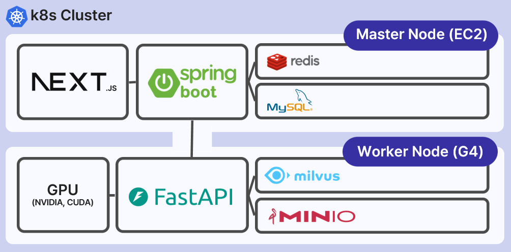
</p>
<p>
      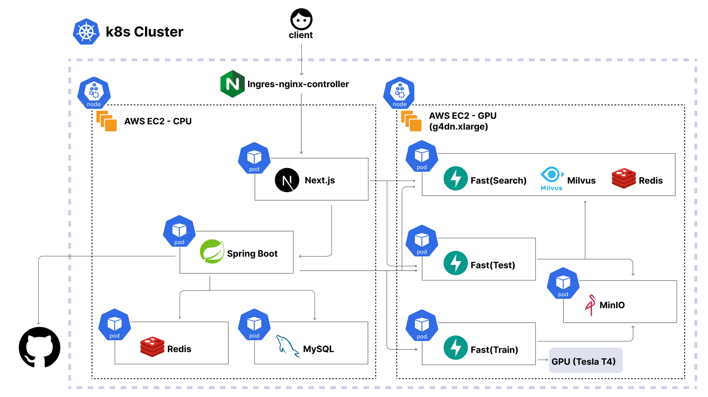
</p>

### ERD

<hr>
<p>
  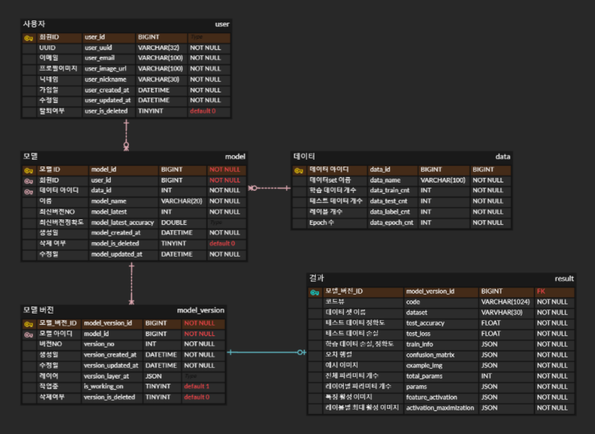
</p>

### Tech Stack<hr>

**Environment**

[](https://code.visualstudio.com/)
[](https://www.jetbrains.com/idea/)
[](https://lab.ssafy.com/s11-webmobile1-sub2/S11P12A804)

**Development**


**AI**


**INFRA**


**Communication**


## 서비스 기능

### 1. 랜딩페이지

<p>
  
</p>

- `랜딩 페이지`에는 플랫폼에 대한 간단한 설명이 포함되어 있습니다.
<br><br>
<p>
  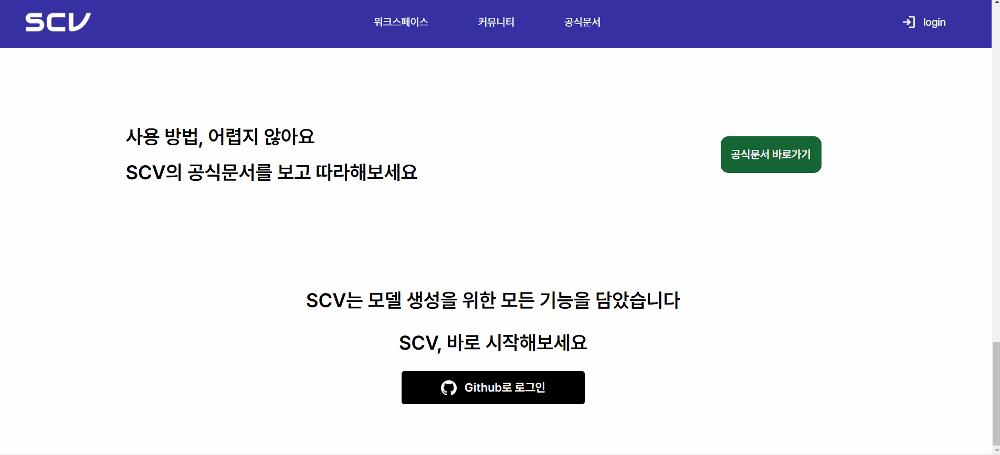
</p>
<p>
  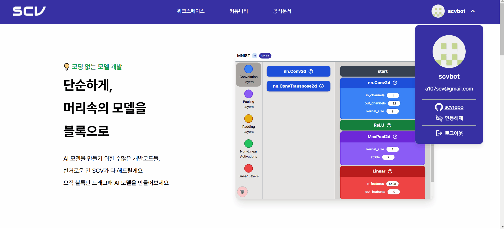
</p>

- 사용자는 `Github OAuth`를 통해 로그인/로그아웃 할 수 있습니다.
<br><br>
<p>
  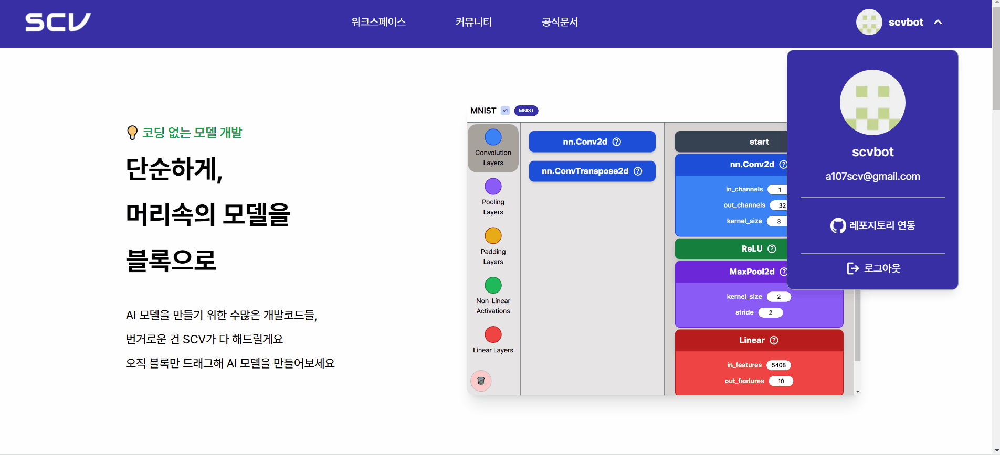
</p>

- 사용자는 `Github`의 새로운 레포지토리와 연동 또는 기존의 레포지토리와 연동할 수 있습니다. - 연동 이후 `연동해제`버튼을 통해 연동 해제 가능합니다.
  <br><br>

### 2. 워크스페이스

<p>
  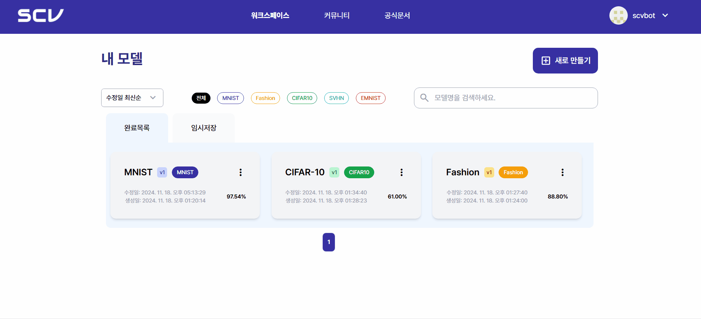
</p>

- **검색 및 필터링 시스템** - 다양한 `필터링 옵션`을 제공하여 모델 조회가 가능합니다. - 데이터셋 (MNIST 외 4개) - 수정일/생성일 기준 정렬 - 모델명 검색 - 완료 / 임시저장 상태
<br><br>
<p>
  
</p>

- **새로 만들기** - 모델 이름 설정과 데이터 지정 후 모델을 제작할 수 있습니다.
  <br><br>

### 3. 블록코딩

<p>
  
</p>

- **블록 코딩**: 드래그 앤 드롭으로 블록을 옮기고 파라미터들을 작성해 블록 코딩이 가능합니다. - **휴지통**: 블록을 삭제합니다. - **저장**: 저장 버튼을 통해 작업 중 저장이 가능합니다. - **실행**: - **실행 이전 저장**: 실행 전 자동 저장 기능을 제공합니다. - **유효성 검증**: 파라미터 값에 이상이 있을 시 실행 전 유효성 검사를 시행합니다. - **코드뷰 & 정확도**: 실행 이후 블록을 코드로 변환하여 보여줍니다.
<br><br>
<p>
  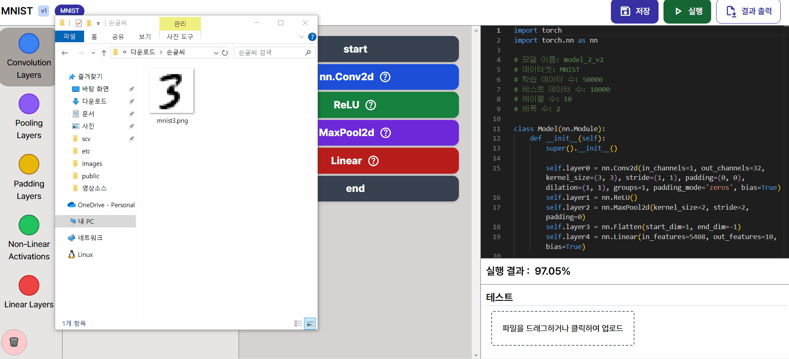
</p>

- **테스트**: 사용자의 파일로 학습 결과를 테스트해볼 수 있습니다.
<br><br>
<p>
  
</p>

- **결과 출력**: 모델에 대한 보고서를 작성하여 사용자에게 제공합니다.
  <br><br>

### 4. 워크스페이스 - 상세

<p>
  
</p>

- **깃허브 내보내기**: 연동된 사용자의 레포지토리로 `.py`파일로 코드를 내보냅니다.
<br><br>
<p>
  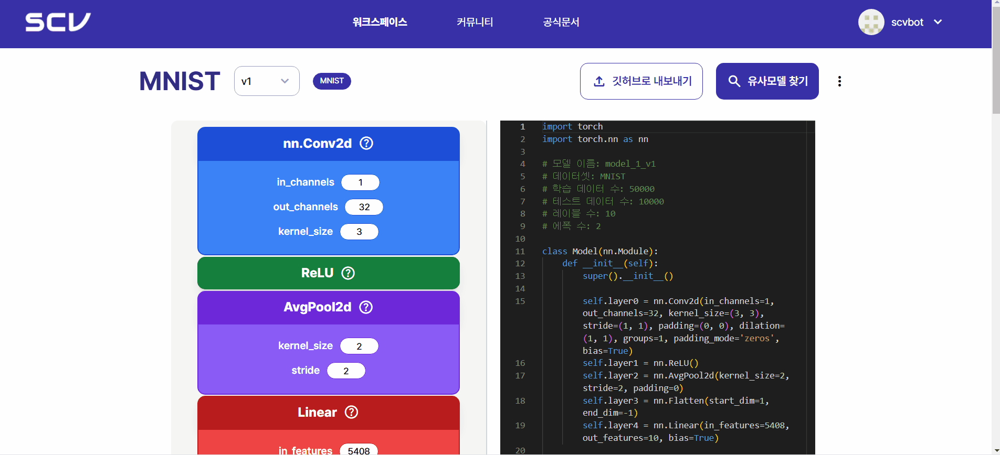
</p>

- **유사모델 찾기**: 레이어를 선택하여 가장 유사한 모델을 검색하여 보여줍니다.
<br><br>
<p>
  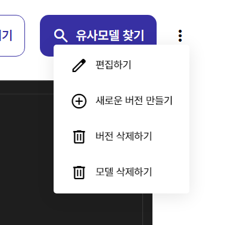
</p>

- **편집하기**: 모델을 수정 가능합니다.
- **새 버전 만들기**: 현재 버전을 토대로 새 버전을 제작합니다.
- **버전 삭제하기**
- **모델 삭제하기**
  <br><br>

### 5. 커뮤니티

<p>
  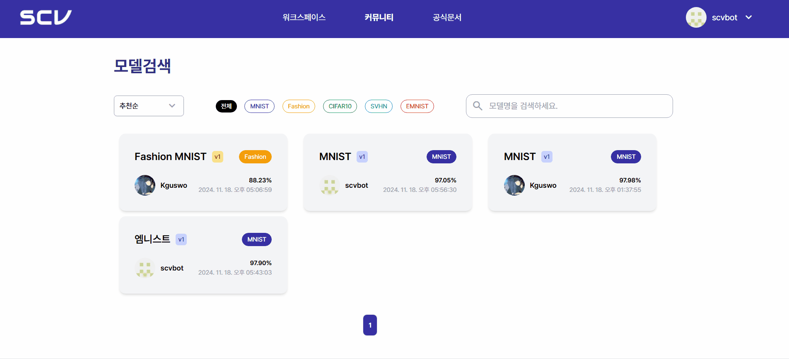
</p>

- 타인이 제작한 모델을 조회 가능합니다.
  <br><br>

### 6. 공식 문서

<p>
  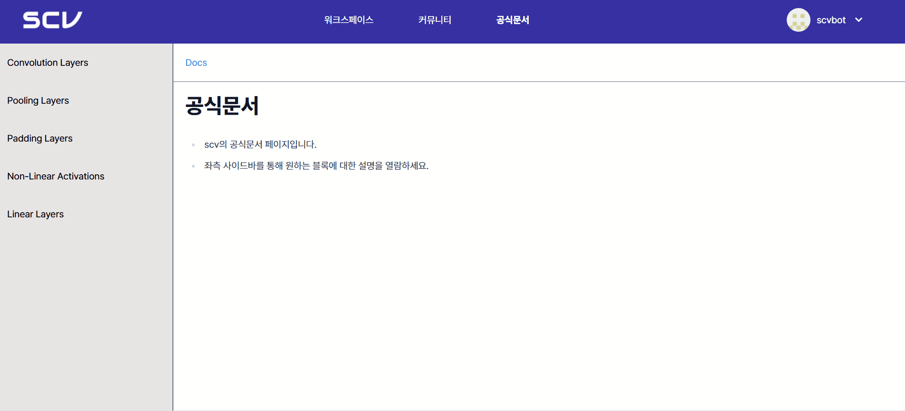
</p>
- 레이어 정보를 담은 공식 문서를 제공합니다.
<br><br>

## 후기

**현재 (본인)**

> - 이번 프로젝트에서 AI/BE 파트를 담당하며 `Python`, `Machine Learning`, `Fastapi` 학습을 하였고, 그리고 `DeepLearning Model`과 각 `Layer`에 대한 이해도를 향상시킬 수 있었습니다. 
> - 사용자가 직관적으로 딥러닝 모델을 구성할 수 있도록 하는 `블록코딩 인터페이스`의 백엔드를 구현하면서 복잡한 기술을 단순화하여 접근성을 높이는 것의 가치를 경험했습니다.
> - 객체지향 설계, 디자인패턴 적용, 확장성 있는 아키텍처 등 소프트웨어 공학적 측면에서도 많은 성장이 있었으며, 팀원들과의 협업을 통해 효율적인 커뮤니케이션과 문제 해결 방법에 대해 배울 수 있었습니다.
> - MLOps 관련 도구 (MinIO, Milvus)를 활용해보며 실제 프로덕션 환경에서의 모델 관리 방법에 대한 이해도를 높일 수 있었습니다.

> - ### 주요 구현 사항은 다음과 같습니다.
>   1. **모델 빌더 시스템**: JSON 형태의 블록 코딩 구성을 실제 PyTorch 모델로 변환
>   2. **데이터 처리 파이프라인**: MNIST, FASHION_MNIST 등 다양한 데이터셋에 특화된, 확장성을 고려한 전처리 시스템
>   3. **모델 저장 및 관리 시스템**: MinIO를 활용한 모델 저장 및 캐싱 메커니즘
>   4. **커스텀 데이터 추론 시스템**: 사용자 업로드 이미지에 대한 테스트 환경 구축, 예측값 처리
>   5. **코드 생성 시스템**: 학습된 모델을 실행 가능한 파이썬 코드로 변환 (Github저장소에 업로드 처리) -> [업로드 예시 저장소 - scv-test repo](https://github.com/Kguswo/scv-test) , [업로드 예시 코드 - mnist.py](https://github.com/Kguswo/scv-test/blob/master/MNIST/mnist/model.py)

> - ### 주요 구현 내용
> - 1. 모델 빌더 시스템 - [neural_network_builder](https://github.com/Kguswo/SCV/tree/681a08fa555c8fea76b95794402b11962b7d1538/ai/fastapi/model_test/neural_network_builder)
>   - Pydantic을 활용한 강력한 레이어 검증 시스템으로 사용자 입력 오류 최소화
>   - Conv2D와 Linear 레이어 사이에 필요시 자동으로 Flatten 레이어 삽입하여 사용자 편의성 향상 - [_insert_flatten_layer](https://github.com/Kguswo/SCV/blob/681a08fa555c8fea76b95794402b11962b7d1538/ai/fastapi/model_test/neural_network_builder/builders/model_builder.py#L73)
>   - 컨볼루션, 풀링, 활성화 함수, 선형 레이어 등 다양한 PyTorch 레이어 지원
>     
> - 2. 데이터 처리 파이프라인
>   - 각 데이터셋 특성에 맞는 전용 전처리기 구현 (MNIST, FASHION_MNIST, CIFAR10, SVHN, EMNIST) - [preprocess](https://github.com/Kguswo/SCV/tree/681a08fa555c8fea76b95794402b11962b7d1538/ai/fastapi/model_train/datasets/preprocess)
>   - 확장성을 고려한 전처리기 팩토리 패턴 구현
>   - YAML 설정 파일을 통한 데이터셋별 전처리 파라미터 관리로 코드 변경 없이 설정 변경 가능 - [PreprocessorFactory](https://github.com/Kguswo/SCV/blob/681a08fa555c8fea76b95794402b11962b7d1538/ai/fastapi/model_train/datasets/preprocess/preprocessor_factory.py#L6)
>     
> - 3. 모델 저장 및 관리 시스템
>   - MinIO를 활용한 클라우드 기반 모델 저장소 구현
>   - 모델 메타데이터 관리 및 버전 관리 지원
>   - 로컬 캐싱 메커니즘으로 성능 최적화 - [inference_handler.py](https://github.com/Kguswo/SCV/blob/681a08fa555c8fea76b95794402b11962b7d1538/ai/fastapi/model_train/inference/inference_handler.py#L61)
>     
> - 4. 커스텀 데이터 추론 시스템
>   - FastAPI 기반의 모델 추론 API 구현
>   - 사용자 업로드 이미지에 대한 전처리 및 예측값 도출 테스트 - [inference_routes.py](https://github.com/Kguswo/SCV/blob/681a08fa555c8fea76b95794402b11962b7d1538/ai/fastapi/model_train/api/routes/inference_routes.py#L63)
>   - 다양한 오류 상황에 대응하는 세분화된 예외 처리 시스템
>     
> - 5. 코드 생성 시스템
>   - 학습된 PyTorch 모델의 구조를 분석하여 파라미터 추출
>   - 모델을 실행 가능한 독립적인 파이썬 코드로 변환 [model_code_generator.py](https://github.com/Kguswo/SCV/blob/681a08fa555c8fea76b95794402b11962b7d1538/ai/fastapi/model_test/neural_network_builder/builders/model_code_generator.py)
>   - GitHub 저장소로 내보내기 기능 지원 ([업로드 예시 저장소](https://github.com/Kguswo/scv-test), [업로드 예시 코드](https://github.com/Kguswo/scv-test/blob/master/MNIST/mnist/model.py))

> - ### 주요 기술적 특징
> - 1. 객체지향 설계
>   - 각 기능별로 명확한 책임을 가진 클래스로 시스템 구조화
>   - 추상 클래스와 인터페이스를 활용한 확장성 있는 설계
>   - 팩토리 패턴, 빌더 패턴 등 디자인 패턴 적절히 활용
> - 2. 데이터 검증
>   - Pydantic을 활용한 강력한 입력 검증
>   - 각 레이어 타입별 필수 파라미터와 검증 규칙 정의
>     ```python
>     class Conv2d(BaseModel):
>        name: Literal["Conv2d"]
>        in_channels: int = Field(gt=0)
>        out_channels: int = Field(gt=0)
>        kernel_size: int = Field(gt=0)
>    
>        @field_validator('kernel_size', 'stride')
>        @classmethod
>        def validate_positive(cls, v: int, info) -> int:
>            if v <= 0:
>                raise ValueError(f'{info.field_name} 는 양수여야 합니다.')
>            return v
>     ```


**서현**

> - 전반적인 화면 디자인을 담당하면서 `UI/UX`를 고려함과 동시에 `마크업` 효율성을 높이기 위한 방법을 고민하는 기회가 되었습니다.
> - `TypeScript`와 `Axios`를 활용해 `커스텀 API Handler`를 작성하여 안전하고 효율적인 `API 소통`을 할 수 있었으며, 통일된 `컨벤션`과 `컴포넌트화`에 공을 들여 언제든지 팀원들이 기여하고자 할 경우 제 코드를 활용할 수 있도록 하고자 하였습니다.
> - `Tailwind CSS`와 `Tanstack Query`를 새롭게 배워 적용하며, 각 라이브러리들의 장점을 잘 살리기 위해 공부하며 성장할 수 있었습니다. 우선 `Tailwind CSS`의 경우 유틸리티 기반 접근 방식 덕분에 빠르고 일관된 스타일링이 가능하다는 것을 깨달았습니다. 특히 반복적인 스타일링 작업을 줄여 생산성을 높일 수 있었으며, 유지보수도 훨씬 간편했습니다. 둘째로 서버 상태와 클라이언트 상태를 관리하는 데 있어 `TanStack Query`의 캐싱 및 리페치 기능은 매우 유용했습니다. 특히, 데이터를 효율적으로 가져오고 상태를 관리할 수 있어서 복잡한 비동기 통신 로직을 단순화할 수 있었습니다. API 요청과 관련된 에러 처리와 재시도 기능도 쉽게 관리할 수 있었습니다.
> - 프로젝트에서 가장 어려웠던 부분은 `드래그 앤 드롭` 기능이 들어간 `블록 코딩` 기능이었습니다. 드래그 앤 드롭 라이브러리를 커스텀하여 블록 코딩에 맞추어 작성하였으며, 동시에 백엔드와의 통신 시 필요한 데이터들만 전송할 수 있도록 `blockStore`에서 상태 관리를 함은 물론 `utils`로 `block-converter` 를 작성해 책임 분담에 힘을 주었습니다.
> - 전체적으로 프론트엔드 파트를 혼자 담당하게 되면서 개발의 전 과정에서 주도적인 의사결정과 책임감 있는 구현이 필요했습니다. 이 과정에서 백엔드 팀원들과의 협업을 통해 `RESTful API 설계`에 참여하고, `api`구현 시 긴밀하게 소통하며 효율적인 커뮤니케이션 방법을 배웠습니다.

**민우**

> - 목표
>   - Spring Security, OAuth2.0, JWT, Redis를 활용해 인증/인가 기능을 성능, 보안, 가용성 측면에서 안정적으로 구현
>   - SOLID 원칙을 준수한 GitHub RestAPI 설계
>   - 낮은 결합도, 높은 응집도 기반의 확장성, 이식성 좋은 아키텍처 구조

> - 후기
>   - Spring Security는 Configuration 설정이 90% 일 정도로 설정 파일에 따라 방향성을 잃기가 쉬운 것 같다고 느꼈고, Security 의존성을 추가하면서 생기는 SecurityFilterChain에 대한 이해와 FilterChain 동작 순서, 원리 및 CustomFilter와 CustomHandler의 구현 방향성이 중요하다고 느꼈다. OAuth2.0 프로토콜도 마찬가지로 프로토콜 요청 흐름을 놓치지 않고 설계 의도에 맞게 구현하는 것이 중요한 것 같았다.
>   - JWT는 Access Token과 Refresh Token을 사용했고 JwtVerifyFilter를 통해 토큰에 대한 유효성 및 인증, 재발급 등을 관리했다. 보안적으로 HttpOnly Cookie를 통한 XSS 공격 방어, SameSite Strict 설정을 통한 CSRF 공격 방어를 진행했고 JWT 파싱 과정에서 각 토큰별로 별도의 비밀키를 통해 안정성을 높였다. Access Token 재발급에선 Refresh Token Rotation을 통해 토큰 탈취에 대한 보안성을 높였다. Access Token의 Claim에는 인증, 인가에 필요한 유저의 데이터 중 비교적 덜 민감한 데이터 위주로 담았지만 유저의 요청에 대해 DB를 조회하지 않고 바로 사용해도 충분할만큼 담아서 RDB 조회에 대한 부담을 줄였다. OAuth Token의 경우 매우 민감한 정보여서 AES 암호화 알고리즘을 통해 데이터 유출에 대한 대비를 했다. Access Token은 토큰의 만료시간과 토큰을 담은 쿠키의 만료시간을 별도로 둬서 쿠키만 남아있으면 로그인 유지를 할 수 있고 쿠키도 만료되면 로그아웃이 되도록 구현해서 자동 로그아웃을 구현했다. Refresh Token은 로그아웃 시 Whitelist 삭제를 통해 모든 기기 로그아웃으로 구현했는데 서비스 특성상 단일 디바이스 환경에서 사용할 것으로 예상해 적합하다고 판단했다.
>   - Redis를 활용한 토큰 관리의 경우 무상태 인증이 JWT의 장점이라고 생각하는데, 이를 상태관리하는 Blacklist나 Whitelist의 도입에 대해 많은 고민이 있었다. 세션과 Redis의 조합으로 인증/인가를 구현할까 고민을 하다가 JWT와 Redis의 조합이 DB에 대한 부담이 더 적을 것으로 예상해서 초기 Access Token Blacklist 1개, Refresh Token Whitelist 1개 총 2개를 사용하여 구현했다. 개발 과정에서 GitHub OAuth Token은 Spring SecurityContext를 통해 관리했는데 서비스 확장성 및 가용성 측면에서 좋지 않다고 판단해 OAuth Token Whitelist를 추가로 둬서 별도로 관리하는 방식으로 구현했고, 이를 통해 안정적으로 토큰 관리를 할 수 있었다. 토큰 저장소는 CRUD 작업이 빈번하게 발생할 것으로 예상해 모두 InMemory DB인 Redis를 통해 구현했으며, 조회 작업이 빈번하고 쓰기 작업은 적을 것으로 예상된 Access Token Blacklist는 Redis Master Slave 구조를 활용해 Write DB와 Read DB로 구분하고 Slave에 대한 로드밸런싱을 통해 성능적 이점을 챙기려고 했다.

    - GitHub Rest API는 RestTemplate 방식으로 먼저 구현했다가 Spring Boot 3.2부터 지원하는 RestClient 방식으로 한번 더 구현하고 두 가지 방식이 GithubApiService 인터페이스를 상속 받도록 구현했다. RestClient 방식의 경우 함수형 프로그래밍 스타일로 코드가 깔끔해지고 exception handler를 클래스 내부에서 구현해서 굉장히 만족스러웠는데 학습 자료가 많이 없어서 아쉬웠다.
    - GitHub Rest API 구현은 메인 로직은 GithubService에서 처리하고 API 호출만 주입한 GithubApiService에서 처리하는 방식으로 구현했는데 역할 구분이 깔끔하게 잘된거 같아서 마음에 들었다.

> - 발전 방향
>   - 10개 가량의 기본 SecurityFilter 및 SecurityContext에 대해 직접 커스텀해가며 구현하면 이해도가 많이 올라갈 것 같고 FilterChain 자체를 추가로 구현해도 좋을 경험이 될 것 같다. 현재 Github OAuth 위주로 인증, 인가 기능이 구현되어 있는데 다중 OAuth 환경 및 자체 로그인까지 통합할 수 있게 추상화하면 더 완성도가 높아질 것 같다.
>   - JwtVerifyFilter에 대한 구현이 상당히 어려웠는데 사람마다 다 구현방식이 달라서 좋은 정답을 찾기가 어려웠다. 좋은 정답이 있다면 그에 맞게 디벨롭하면 좋을 것 같다. Access Token의 경우 local storage, httponly cookie, front memory 3가지 저장소 중 하나를 사람마다 다르게 선택했는데 front memory 저장 방식에 대한 고민을 더 해보면 좋을 것 같다.
>   - Redis를 활용한 토큰 관리에서 Refresh Token Whitelist와 OAuth Token Whitelist의 경우 Redis Cluster를 활용해 단일 Redis 환경에 대한 단점을 보완할까 고민했는데 기술적 적합성에 대한 고민과 Kubernetes 환경에서 Redis Cluster를 구현하는 것이 학습 난이도 측면과 프로젝트 일정상 어렵다고 판단했다. Redis Cluster가 아니더라도 Redis Container 장애에 대한 보완책이 준비된다면 더 완성도 높은 프로젝트가 될 수 있을 것 같다. 추가로 Redis Master Slave 역시 Redis Sentinel을 통한 고가용성 확보가 더해지면 완성도가 높아질 것 같았고, 로드밸런싱을 Kubernetes에서 해주는지 Spring 내부에서 해주는지 판단하기 어려웠는데 이에 대한 학습이 필요할 것 같았다.
>   - RestTemplate 방식과 RestClient 방식에 대한 DI까지는 잘 구현이 됐는데 성능 테스트를 해보지 못한게 약간 아쉬웠고, 추후 Non-blocking과 비동기 방식을 지원하는 WebClient와 비교 테스트를 해보면 좋을 것 같다.
>   - GithubService에서 토큰 처리 등의 로직이 섞여서 로직이 깔끔하게 진행되지는 않았다. 이 부분에 대한 명확한 역할 분담과 handler 등을 활용하면 더 깔끔하게 작성될 것 같다.

**예진**

> - 목표: 쿠버네티스를 사용하여 파드들을 보다 효율적으로 관리하고, CPU서버와 GPU서버를 하나의 클러스터로 연결하여 서버 간 통신을 외부로 노출하지 않고 내부에서 관리하고자 하였다. 또한 각 사용자들의 ai모델을 개발하는 서비스인만큼 각각의 워크 스페이스를 컨테이너화 된 환경으로 제공하고자 하였다. 컨테이너 배포에 관해서는 argo rollout 을 사용하여 블루/그린 무중단 배포 환경을 구축하고자 하였다.
> - 어려웠던 점:
>   - EC2 서버는 사무국 측 계정으로 제공된 기본 서버이고, GPU서버는 교보재 신청을 통해 팀 계정으로 사용했기 때문에 두 서버의 서브넷이 달라 노드 join에 반복해서 실패했다. 네트워크와 쿠버네티스에 대한 기초지식이 부족한 탓에 발생한 문제였다. 서브넷이 서로 다른 노드를 하나의 클러스터에 join하기 위해서는 보안규칙을 수정하거나 vpn 우회를 설정해야 했다. EC2 서버의 보안규칙 등을 조작하는 것이 자유롭지 못한 상황이었기 때문에 vpn 사용을 선택했다.
>   - vpn우회를 설정함으로써 쿠버네티스 내부 통신 설정을 수정할 필요가 있었는데, 마찬가지로 쿠버네티스 기본 네트워크에 대한 이해도가 낮은 상태였기 때문에 여러가지 설정을 마치는데에 시간이 오래걸렸다.
>   - 컨테이너에서 사용하는 각 이미지에 대한 구체적인 정보를 확인하지 않은 채 사용해서 정해진 포트를 사용해야 함을 알지 못해 오래 헤맸다. 또 컨테이너 환경에서는 타임존 설정을 별도로 해주어야 할수도 있다.

> - 아쉬웠던 점:
>   - 서비스 구조상 사용자별 워크스페이스를 컨테이너로 제공하는 것까지 확장되지 못했다. 그러나 쿠버네티스를 활용한 프로그램의 확장 가능성을 보다 쉽게 그려볼 수 있게 되었다.
>   - 소셜로그인을 통해 사이트에서 리다이렉트를 2번 받을 때 요청을 받는 파드가 각각 다르면 로그인에 성공하지 못하는 문제점을 발견했다. 블루/그린 무중단 배포 환경에서는 검증 과정에서 테스트 파드가 띄워지기 때문에 로그인에 실패하게 된다. 이를 해결하기 위해서는 큐를 사용하여 두번의 요청을 같은 파드로 전달하는 방법을 사용할 수 있었지만, 마감 일정상 파드를 새로 띄우는 방식에 그쳤던 점이 아쉽다.

> - 해결방법 / 성장한 점:
>   - 파드 내부에서 통신이 어디까지 어떤 방식까지 가능한지 확인하는 등 문제의 원인을 찾기 위해 단계적으로 접근한 것이 큰 도움이 되었다. 함께 도와준 팀원들의 디버깅 방식에서 많이 배웠다.
>   - 인프라에 관심이 있지만 네트워크에 대한 지식이 부족함을 알고 직접 부딪히기 위해 도전했던 만큼 각각의 개념을 몸소 체험하면서 공부할 수 있었다. 이론을 다시 읽을 때 어떤 부분을 이야기 하는지 더 잘 알 수 있고, 아키텍처 레퍼런스를 다양하게 찾아봐야겠다는 방향성을 찾았다.

**동엽**

> - **목표**
>   - **ORM을 사용한 객체지향 프로그래밍**: 객체지향 설계를 통해 데이터 관리 효율성 증대
>   - **최적화와 데이터 일관성**: 데이터 처리 속도와 정확성을 동시에 개선

> - **아쉬웠던 점**
>   - **N+1 문제**: 데이터 조회 시 불필요한 쿼리 호출로 인한 성능 저하
>   - **RestTemplate 사용**: FastAPI와의 통신에서 코드의 간소화와 유지보수성 부족

> - **배운 점**
>   - **상속 활용**: `ResultDTO` 및 `ResultWithImageDTO` 구현으로 객체 구조 단순화 및 재사용성 강화
>   - **다형성 적용**: `LayerDTO` 설계를 통해 유연한 계층 구조와 데이터 표현 방식 구현

**도형**

> - **`Kubernetes`**
>   - GPU 서버의 쿠버네티스 노드를 구축하면서 쿠버네티스의 네트워킹 시스템에 대해 많은 것을 배울 수 있었습니다.
>   - 파드 디자인에 대해서도 오래 고민해 볼 수 있는 좋은 기회였습니다.
>   - 하지만, 기존의 목표였던 GPU 서버의 리소스 관리와 모니터링을 끝내 구현하지 못한 것이 아쉽습니다.

> - **`CNN`**
>
>   - CNN에 대해 깊이 탐구하고 설명력을 부여하기 위한
>     - feature activation
>     - activation maximization
>     - 유효성 검증
>     - CKA
>
>   를 공부해보는 좋은 기회였습니다.

> - **`MinIO`**
>   - 모델 레지스트리와 데이터셋 레지스트리를 구성해 MLOps의 요소를 구현해 보았고,

> - **`Milvus`**
>   - Milvus로 CKA 메트릭을 효율적으로 검색하는 시스템도 구현할 수 있었습니다.

> - **`FastAPI`**
>   - 조금이나마 익숙해진 FastAPI에서의 예외처리와 Pydantic을 이용한 클래스 정의에 대해 추가로 배웠습니다.
>   - 같이 api를 작성한 팀원의 폴더 구조 방식을 보면서 많은 것을 배웠습니다.
